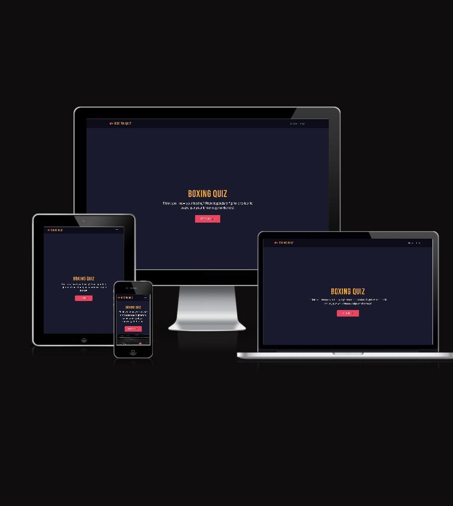
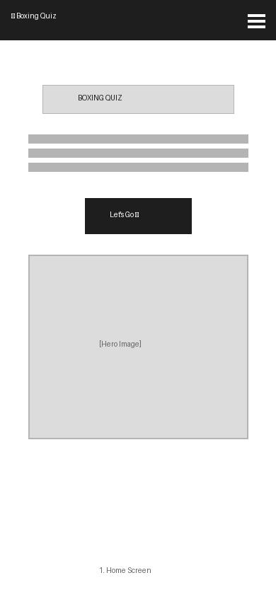
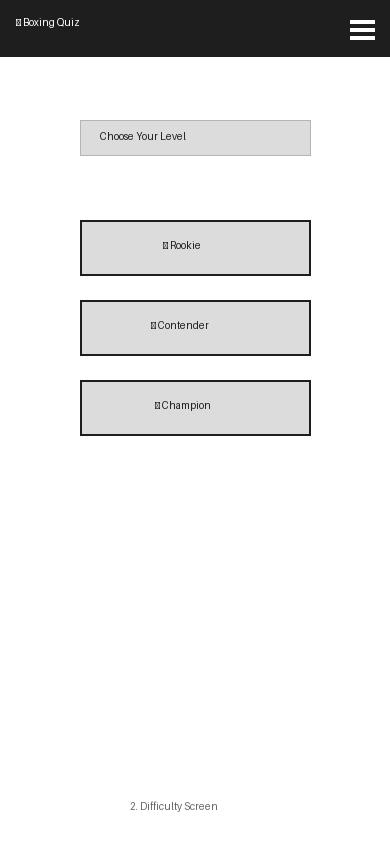
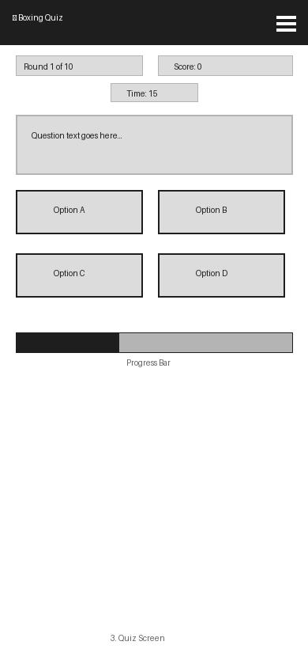
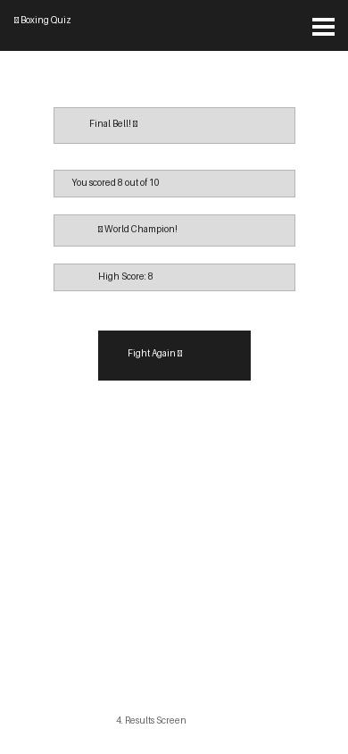

# Boxing Quiz 🥊

A fun and interactive boxing knowledge quiz built with HTML, CSS and JavaScript. Test your boxing knowledge across three difficulty levels — Rookie, Contender and Champion — and see if you can earn the Undisputed Champion belt!

Live site: [Boxing Quiz](https://hassib-95.github.io/boxing-quiz/)

---

## Table of Contents

- [User Experience (UX)](#user-experience-ux)
- [Features](#features)
- [Technologies Used](#technologies-used)
- [Testing](#testing)
- [Deployment](#deployment)
- [Credits](#credits)

---

## User Experience (UX)

### Site Goals

The goal of the Boxing Quiz is to provide boxing fans with an entertaining and challenging quiz experience. Users can test their knowledge at their own pace and track their improvement through the high score feature.

### User Stories

| ID | User Story | Priority | Status |
|----|-----------|----------|--------|
| #1 | As a user, I want a responsive navigation bar so I can easily move around the site | Must Have | ✅ Done |
| #2 | As a user, I want a clear landing page with a start button so I know how to begin | Must Have | ✅ Done |
| #3 | As a user, I want to choose a difficulty level so I can play at my skill level | Must Have | ✅ Done |
| #4 | As a user, I want multiple choice questions with 4 options so I can select my answer | Must Have | ✅ Done |
| #5 | As a user, I want instant feedback on my answer so I know if I was correct | Must Have | ✅ Done |
| #6 | As a user, I want my score tracked during the quiz so I can see how I am doing | Must Have | ✅ Done |
| #7 | As a user, I want a final score screen with a belt rating so I get a fun result | Must Have | ✅ Done |
| #8 | As a user, I want to restart the quiz without refreshing the page | Must Have | ✅ Done |
| #9 | As a user, I want the quiz to work on all screen sizes | Must Have | ✅ Done |
| #10 | As a user, I want a countdown timer per question to add challenge | Should Have | ✅ Done |
| #11 | As a user, I want to see which round I am on so I know my progress | Should Have | ✅ Done |
| #12 | As a user, I want my high score saved so I can try to beat it next time | Should Have | ✅ Done |
| #13 | As a user, I want to see the correct answer when I get one wrong | Could Have | ✅ Done |
| #14 | As a user, I want a progress bar so I can see how far through the quiz I am | Could Have | ✅ Done |
| #15 | As a user, I want sound effects to make the quiz more engaging | Could Have | ❌ Not implemented |

### Wireframes

*Home Screen*

*Difficulty Screen*

*Quiz Screen*

*Results Screen*

### Design

*Colour Scheme*

| Colour | Hex | Usage |
|--------|-----|-------|
| Dark Navy | #1a1a2e | Background |
| Boxing Red | #e94560 | Buttons and accents |
| Gold | #f5a623 | Headings and highlights |
| White | #ffffff | Body text |

*Typography*

- *Bebas Neue* — Used for headings, buttons and trackers. A bold, condensed font that fits the boxing theme.
- *Inter* — Used for body text and paragraphs. A clean, readable font for longer text.

Both fonts are imported from Google Fonts.

---

## Features

### Existing Features

*Navigation Bar*
- Fixed to the top of the page on all screen sizes
- Collapses to a burger menu on mobile devices
- Navbar links navigate to the correct section of the single page app

*Landing / Home Section*
- Clear heading and description
- Prominent "Let's Go" call to action button
- Hero image displayed on mobile to fill the screen

*Difficulty Selection*
- Three difficulty levels: Rookie, Contender and Champion
- Each level has 10 unique questions
- 30 questions in total across all difficulties

*Quiz Section*
- Round tracker shows current question out of total
- Score tracker updates in real time
- Countdown timer of 15 seconds per question
- Question displayed clearly with 4 multiple choice options
- Correct answer highlighted in green, incorrect in red
- If wrong, the correct answer is also shown in green
- Progress bar fills as the quiz progresses

*Results Screen*
- Final score displayed clearly
- Belt rating based on percentage scored:
  - 100% — Undisputed Champion 🏆
  - 80%+ — World Champion 🥇
  - 60%+ — Contender 🥈
  - 40%+ — Amateur Boxer 🥉
  - Below 40% — Back to the Gym 🩹
- High score saved to localStorage and displayed
- Fight Again button to restart without refreshing

### Features Left to Implement

- Sound effects for correct and incorrect answers
- Leaderboard to compare scores with other users
- Additional difficulty levels and question categories

---

## Technologies Used

### Languages

- HTML5
- CSS3
- JavaScript (ES6)

### Frameworks and Libraries

- [Bootstrap 5.3](https://getbootstrap.com) — Responsive layout and components
- [Google Fonts](https://fonts.google.com) — Bebas Neue and Inter fonts

### Tools

- [VS Code](https://code.visualstudio.com) — Code editor
- [Git](https://git-scm.com) — Version control
- [GitHub](https://github.com) — Code repository and deployment
- [Favicon.io](https://favicon.io) — Favicon generation
- [TinyPNG](https://tinypng.com) — Image compression
- [Squoosh](https://squoosh.app) — Image conversion to WebP
- [Figma](https://figma.com) — Wireframe creation

---

## Testing

### Manual Testing

| Feature | Expected | Result | Pass/Fail |
|---------|----------|--------|-----------|
| Let's Go button | Shows difficulty section | Works as expected | ✅ Pass |
| Rookie button | Loads rookie questions | Works as expected | ✅ Pass |
| Contender button | Loads contender questions | Works as expected | ✅ Pass |
| Champion button | Loads champion questions | Works as expected | ✅ Pass |
| Correct answer | Button turns green, score increases | Works as expected | ✅ Pass |
| Wrong answer | Button turns red, correct shown in green | Works as expected | ✅ Pass |
| Timer countdown | Counts down from 15 each question | Works as expected | ✅ Pass |
| Timer runs out | Moves to next question automatically | Works as expected | ✅ Pass |
| Round tracker | Updates on each question | Works as expected | ✅ Pass |
| Score tracker | Updates after each correct answer | Works as expected | ✅ Pass |
| Progress bar | Fills as quiz progresses | Works as expected | ✅ Pass |
| Results screen | Shows correct score and belt rating | Works as expected | ✅ Pass |
| High score | Saves to localStorage and displays | Works as expected | ✅ Pass |
| New high score | Shows new high score message | Works as expected | ✅ Pass |
| Fight Again button | Returns to home screen | Works as expected | ✅ Pass |
| Navbar Home link | Shows home section | Works as expected | ✅ Pass |
| Navbar Play link | Shows difficulty section | Works as expected | ✅ Pass |
| Navbar burger | Opens and closes on mobile | Works as expected | ✅ Pass |
| Responsive design | Works on mobile, tablet and desktop | Works as expected | ✅ Pass |

### Validator Testing

- *HTML* — Validated using [W3C HTML Validator](https://validator.w3.org). No errors found.
- *CSS* — Validated using [W3C CSS Validator](https://jigsaw.w3.org/css-validator). No errors found. Warnings for CSS variables are expected and do not affect functionality.
- *JavaScript* — Linted using [JSHint](https://jshint.com). No errors found. /* jshint esversion: 6 */ added to confirm ES6 syntax.

### Browser Testing

| Browser | Result |
|---------|--------|
| Chrome | ✅ Works as expected |

### Device Testing

| Device | Result |
|--------|--------|
| MacBook (Desktop) | ✅ Works as expected |
| Mobile (Chrome DevTools) | ✅ Works as expected |
| Tablet (Chrome DevTools) | ✅ Works as expected |

### Known Bugs

No known bugs at time of submission.

---

## Deployment

The site was deployed to GitHub Pages using the following steps:

1. Go to the repository on GitHub: [boxing-quiz](https://github.com/hassib-95/boxing-quiz/)
2. Click *Settings*
3. Click *Pages* in the left sidebar
4. Under *Source* select *Deploy from a branch*
5. Select *main* branch and */ (root)* folder
6. Click *Save*
7. The live site URL will appear at the top of the Pages section

Live site: [https://hassib-95.github.io/boxing-quiz/](https://hassib-95.github.io/boxing-quiz/)

### Forking the Repository

1. Go to the repository on GitHub
2. Click the *Fork* button in the top right corner
3. A copy of the repository will be created in your GitHub account

### Cloning the Repository

1. Go to the repository on GitHub
2. Click the *Code* button
3. Copy the HTTPS URL
4. Open your terminal and run git clone <url>

---

## Credits

### Content

- All boxing questions were written specifically for this project by Hassib Choudry
- Belt rating system designed specifically for this project

### Media

- Hero image sourced from [Pexels](https://www.pexels.com) — free to use
- Favicon generated using [Favicon.io](https://favicon.io)
- Wireframes created using [Figma](https://figma.com)

### Code

- [Bootstrap 5](https://getbootstrap.com) — Responsive grid and components
- [Google Fonts](https://fonts.google.com) — Bebas Neue and Inter fonts
- navbar collapse JavaScript adapted from Bootstrap documentation

### Acknowledgements

- Code Institute for the course material and project brief
- My assessor for their time reviewing this project

---

Developed by Hassib Choudry as part of the Code Institute Level 5 Diploma in Web Application Development
